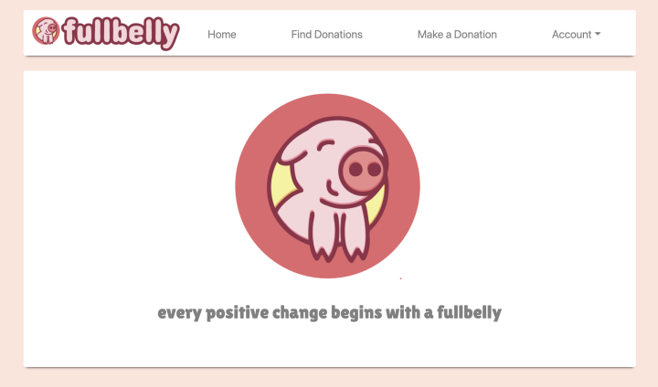
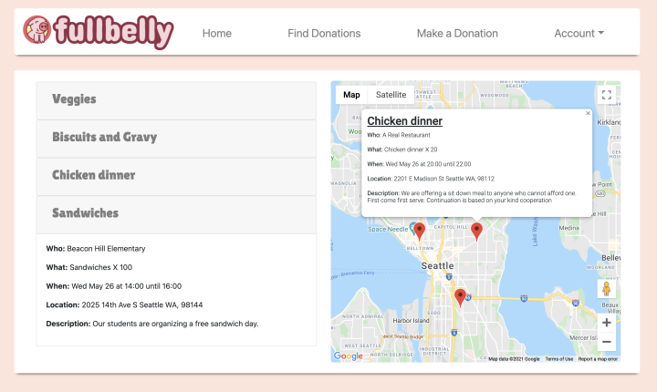
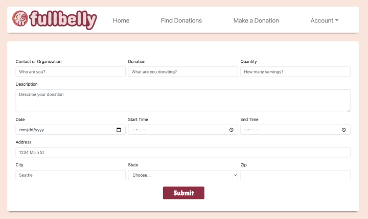
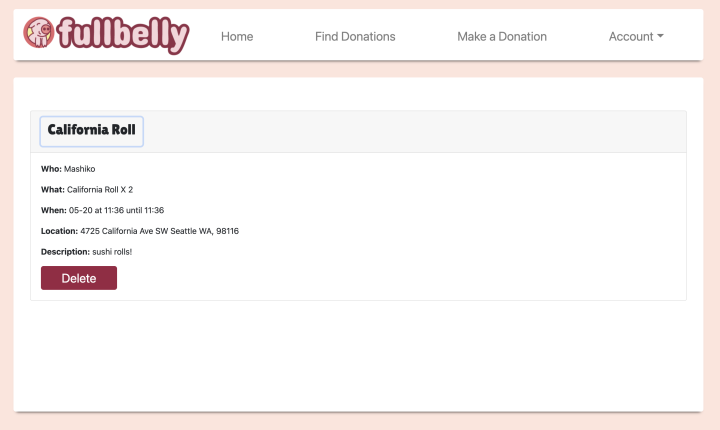

<br>
<br>
<p align="center">
  
  <p align="center">
    ___________________________
  </p>
  <p align="center">
    <a href="https://github.com/Jeroenemo">
      <strong>Jeroen van Seeters</strong> 
    </a>
  </p>
  <p align="center">
    <a href="https://github.com/jeroenemo/FullBelly/graphs/contributors">
      
    </a>
    ¨
    <a href="https://github.com/jeroenemo/FullBelly/issues">
      
    </a>
    ¨
    <a href="https://github.com/jeroenemo/FullBelly/pulls">
      
    </a>
    ¨
    <a href="https://github.com/jeroenemo/FullBelly/stargazers">
      
    </a>
    ¨
    <a href="https://github.com/Pingel88/Best-ReadMe-Template/blob/master/LICENSE.txt">
      
    </a>
  </p> 
</p>

<p align="center">
  <small>Initiated May 27th, 2021, Updated June 11th, 2021</small>
</p>
<p align="center">
    <a href="https://github.com/jeroenemo/FullBelly"><big>Project Docs</big></a> ·
    <a href="https://github.com/jeroenemo/FullBelly/issues"><big>Report Bug</big></a> ·
    <a href="https://github.com/jeroenemo/FullBelly/issues"><big>Request Feature</big></a>
</p>

## 🌐 About the Project

### 📖 Description
<br>
Coming from the food industry, I am acutely aware of the egregious amount of food waste that occurs on a regular basis. This application will allow users to sign in as donors/recipients, and use google maps to post/find a viable meal nearby before it meets the dumpster. This includes misfires at restaurants, baked goods that won’t be able to be sold next day at your local coffee shop, or companies that get their lunches catered that usually have lots and lots of leftovers. The socioeconomic gap in our culture today is immense. I believe by reaching out a helping hand and providing someone with a meal they didn’t have to fish out of the trash can have an immensely positive impact on how we view and treat each other as human beings. This is a really easy way we could help someone less fortunate begin their journey to a happier future. Every positive change begins with a full belly.
<br>
<br>
<p align="center">
<row>
  
  
</row>
<row>
  
  
</row>
</p>
<br>
<br>

### 🦠 Known Bugs

* It's too perfect. (This is just a placeholder, I'm really not that snooty)

### 🛠 Built With

* [Visual Studio Code](https://code.visualstudio.com/)
* [React](https://reactjs.org/)
* [JavaScript](https://www.javascript.com/)
* [TypeScript](https://www.typescriptlang.org/)
* [npm 6.14.5](https://www.npmjs.com/)
* [node 14.5.0](https://www.npmjs.com/)
* [Git & GitHub](https://github.com/)

------------------------------

## 🏁 Getting Started

### 📋 Prerequisites

  #### <u>Download npm & Node.js</u>

  * On macOS Mojave or later
    * [Click here](https://nodejs.org/en/) to download the Node.js SDK from OpenJS for macOS.
  * On Windows 10 x64 or later
    * [Click here](https://nodejs.org/en/download/) to download the Node.js SDK from OpenJS for Windows.

  #### <u>Install npm & Node.js</u>

  Enter the command `npm install -g npm` in Terminal for macOS or PowerShell for Windows.

  To see if you already have Node.js and npm installed and check the installed version, run the following commands:
  * `node -v`
  * `npm -v`

  #### <u>Code Editor</u>

  To view or edit the code, you will need a code editor or text editor. The popular open-source choices for code editors are Atom and Visual Studio Code.

  1) Code editor download:
      * Option 1: [Atom](https://atom.io/)
      * Option 2: [Visual Studio Code](https://code.visualstudio.com/)
  2) Click the download most applicable to your OS and system.
  3) Wait for download to complete, then install -- Windows will run the setup exe and macOS will drag and drop into applications.
  4) Open your editor, and open the Command Palette by pressing `Cmd+Shift+P` for Mac, or `Ctrl-shift-p` for Windows
      * For VS Code, type `Shell Command: Install 'code' command in PATH` into the Command Palette.
      * For Atom, type `Install Shell Commands` into the Command Palette.
  5) Optionally, create a [GitHub account](https://github.com)

### ⚙️ Setup and Use

  #### <u>Cloning</u>

  1) Navigate to the [FullBelly repository here](https://github.com/jeroenemo/FullBelly).
  2) Click 'Code' to reveal the HTTPS url ending with .git and the 'Download ZIP' option.
  3) Open up your system Terminal or GitBash, navigate to your desktop with the command: `cd Desktop`, or whichever location suits you best.
  4) Clone the repository to your desktop: `$ git clone https://github.com/jeroenemo/FullBelly.git`
  5) Run the command `cd FullBelly` to enter into the project directory.
  6) View or edit:
      * Code editor - Run the command `atom .` or `code .` to open the project in Atom or Visual Studio Code respectively for review and editing.
      * Text editor - Open by double clicking on any of the files to open in a text editor.

  #### <u>Download</u>

  1) Navigate to the [FullBelly repository here](https://github.com/jeroenemo/FullBelly).
  2) Click 'Code' to reveal the HTTPS url ending with .git and the 'Download ZIP' option.
  3) Click 'Download ZIP' and extract.
  4) Open by double clicking on any of the files to open in a text editor.

  #### <u>EnvironmentVariables</u>

  1) Create a new file in the root directory named `.env`.
  2) Add the following code snippet to the new EnvironmentVariables.cs file:

      ```
      REACT_APP_GOOGLE_API_KEY=[YOUR GOOGLE API KEY]
      REACT_APP_AUTH0_DOMAIN=[YOUR AUTH0 DOMAIN]
      REACT_APP_AUTH0_CLIENT_ID=[YOUR AUTH0 CLIENT ID]
      ```
  3) Please note that you will have to replace the `[YOUR GOOGLE API KEY]`, `[YOUR AUTH0 DOMAIN]` and `[YOUR AUTH0 CLIENT ID]` placeholders with your own API key, domain, and client ID. Follow along with the subsequent instructions to obtain them.

  #### <u>Acquire API Key</u>

  1) [Sign In](https://console.cloud.google.com/apis/) to the Google Cloud Platform in order to obtain an API key. 
  2) Visit the [Credentials tab](https://console.cloud.google.com/apis/credentials) of the APIs & Services Menu
  3) Navigate to the `CREATE CREDENTIALS` tab and follow the instrucions to generate a dev API key.
  4) Replace the entire `[API KEY]` placeholder text in your EnvironmentVariables.cs file with the API key.

  #### <u>Acquire Auth0 Domain & Client ID</u>

  1) You will have to sign in to your Auth0 account and register your application. If you don't have one already, sign up [here](https://auth0.com/).
  2) Follow these steps to set up your FullBelly app. 
      * Select Apllications.
      * Click on `Create Application`.
      * Name the application.
      * Select `Single Page Web Applications`.
      * Click `Create`.
  3) To acquire the Domain and ID, click on `Settings` under **Applications**.
  4) Replace the entire `[YOUR AUTH0 DOMAIN]` and [YOUR AUTH0 CLIENT ID]` placeholder text in your EnvironmentVariables file with your domain and ID, respectively.
  
  #### <u>Launch Application</u>

  With your environment variables in place, you are only a few terminal commands away from launching the app.
  1) In the FullBelly repository:
      * Enter `npm install` in your terminal.
      * Enter `npm start` in your terminal.

## 🛰️ Add C# & mySQL Backend (optional)

You can visit the backend repo [Here](https://github.com/Jeroenemo/FullBellyAPI.Solution)
INSTRUCTIONS COMING SOON!!!

------------------------------

## 🤝 Contributors

| Author | GitHub | Email |
|--------|:------:|:-----:|
| [Jeroen van Seeters](https://linkedin.com/in/jeroenvanseeters) | [Jeroenemo](https://github.com/jeroenemo) |  [vanseetersjeroen@gmail.com](mailto:vanseetersjeroen@gmail.com?subject=[GitHub]Epicodus%20Capstone) |

------------------------------

## ✉️ Contact and Support

If you have any feedback or concerns, please contact one of the contributors.

<p>
  <a href="https://github.com/jeroenemo/FullBelly/issues">Report Bug</a> ·
  <a href="https://github.com/jeroenemo/FullBelly/issues">Request Feature</a>
</p>

------------------------------

## ⚖️ License

This project is licensed under the [MIT License](https://opensource.org/licenses/MIT). Copyright (C) 2021 Jeroen van Seeters. All Rights Reserved.

```
MIT License

Copyright (c) 2021 Jeroen van Seeters.

Permission is hereby granted, free of charge, to any person obtaining a copy
of this software and associated documentation files (the "Software"), to deal
in the Software without restriction, including without limitation the rights
to use, copy, modify, merge, publish, distribute, sublicense, and/or sell
copies of the Software, and to permit persons to whom the Software is
furnished to do so, subject to the following conditions:

The above copyright notice and this permission notice shall be included in all
copies or substantial portions of the Software.

THE SOFTWARE IS PROVIDED "AS IS", WITHOUT WARRANTY OF ANY KIND, EXPRESS OR
IMPLIED, INCLUDING BUT NOT LIMITED TO THE WARRANTIES OF MERCHANTABILITY,
FITNESS FOR A PARTICULAR PURPOSE AND NONINFRINGEMENT. IN NO EVENT SHALL THE
AUTHORS OR COPYRIGHT HOLDERS BE LIABLE FOR ANY CLAIM, DAMAGES OR OTHER
LIABILITY, WHETHER IN AN ACTION OF CONTRACT, TORT OR OTHERWISE, ARISING FROM,
OUT OF OR IN CONNECTION WITH THE SOFTWARE OR THE USE OR OTHER DEALINGS IN THE
SOFTWARE.
```

------------------------------

## 🌟 Acknowledgements

#### [Epicodus](https://www.epicodus.com/)
>"A school for tech careers... to help people learn the skills they need to get great jobs."

#### [The Internet](https://webfoundation.org/)
>"...the first thing that humanity has built that humanity doesn't understand..."

-Eric Schmidt, Google (Alphabet Inc.)

------------------------------

<p align="center"><a href="#">Return to Top</a></p>